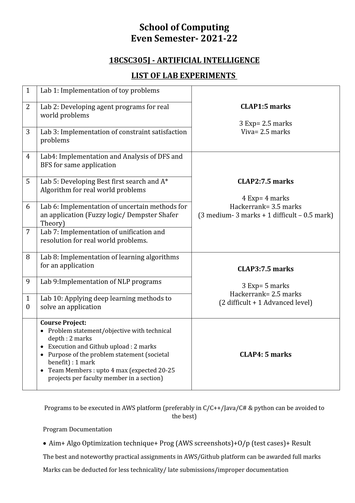

## ARTIFICIAL INTELLIGENCE 

### Course Code : 18CS305J  
### Outcomes of learning this Course:  
- Formulate a problem and build intelligent agents 
- Apply appropriate searching techniques to solve a real-world problem
- Analyze the problem and infer new knowledge using suitable knowledge representation schemes 
- Develop planning and apply learning algorithms on real-world problems  

